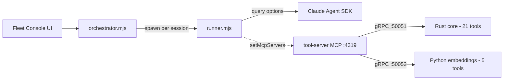

# Claude Orchestrator — Token-Efficiency & Performance Review

**Date:** 2026-06-16
**Status:** All items implemented and verified
**Scope:** `agent-fleet/`, `fleet-console/`, `tool-server/`

---

## 1. System map

The repo contains two generations of the same idea plus a shared tool server:

| Component | Role | Token relevance |
|---|---|---|
| `agent-fleet/` | Puppets the existing Claude Code UI from the outside (VS Code extension + CDP injection). Only ever sends the word `"continue"`. | **Token-neutral** — local I/O/CPU only. |
| `fleet-console/` | Owns sessions via `@anthropic-ai/claude-agent-sdk` (`query()`), one child process per session. This is where every model token is actually spent. | **All optimization lives here.** |
| `tool-server/` | 26 code-intelligence MCP tools (Rust gRPC core + Python embeddings + TS MCP adapter) attached to sessions over MCP HTTP. | **Read-side savings** — return slices instead of whole files/logs. |

---

## 2. What is already efficient (do not change)

- **Context is never manually re-sent.** Conversation lives inside the SDK process; `messages[]` and `conversation.md` are display/persistence only. Continuation pushes the literal string `"continue"`; resume uses `options.resume = <sessionId>`. No transcript re-stuffing.
- **Rate-limit detection is correctly narrowed** to `rate_limit_info.status === "rejected"`, avoiding false positives that would trigger needless continues (extra turns).
- **Cache token accounting is tracked** (`cache_read_input_tokens`, `cache_creation_input_tokens` in `aggregateUsage()`).
- **Dedupe / idle / min-interval guards** in both systems prevent double-continues (double turns).

---

## 3. High-impact token & performance issues

### 3.1 `usage-fetcher` respawns a full SDK + `claude` binary every 5 s
[fleet-console/src/config.mjs](../../fleet-console/src/config.mjs#L19) sets `usage.pollSeconds: 5`, which drives `setInterval(usageTick, …)` in [fleet-console/src/orchestrator.mjs](../../fleet-console/src/orchestrator.mjs). Each tick spawns a fresh Node child that boots the Agent SDK and a `claude_code` session ([fleet-console/src/usage-fetcher.mjs](../../fleet-console/src/usage-fetcher.mjs)).

It takes no model turn (so "costs nothing" is true for *model tokens*), but it is very expensive in process/CPU/startup churn and issues a control request against request-based limits every 5 s.

- **Fix (implemented):** `usage.pollSeconds` default raised **5 → 60** in [fleet-console/src/config.mjs](../../fleet-console/src/config.mjs#L19) (and the example/active config). Verified live: server boots with `usage poll: 60s`. Overridable via `USAGE_POLL_SECONDS`. Reusing one long-lived fetcher session remains a future enhancement.

### 3.2 Extended thinking defaults ON (`adaptive`) for every session
`currentThinking` defaults to `"adaptive"` and `options.thinking = thinkingConfig(currentThinking)` ([fleet-console/src/runner.mjs](../../fleet-console/src/runner.mjs#L388)). Adaptive thinking adds thinking/output tokens to **every** turn — including unattended auto-continues where no human reads the reasoning.

- **Fix (implemented):** unattended (`policy === "auto"`) sessions now default thinking **off** via `config.unattended.thinking` in [fleet-console/src/orchestrator.mjs](../../fleet-console/src/orchestrator.mjs) `createSession`; interactive sessions stay `adaptive`. Explicit per-session choices are still honored, and the new-session form has an **Auto** option that resolves per mode. Verified live: an `auto` session reports `thinking: off`, a `plan` session reports `thinking: adaptive`.

### 3.3 Unattended auto-continue runs with `bypassPermissions` and no `maxTurns`
`auto` policy → `bypassPermissions` ([fleet-console/src/orchestrator.mjs](../../fleet-console/src/orchestrator.mjs#L78)); `maxTurns` is unset by default. After a reset the scheduler fires `"continue"` and the agent runs freely against the fresh quota with no turn ceiling.

- **Fix (implemented):** a configurable `config.unattended.maxTurns` is applied to unattended sessions' query options in `createSession` (default `0` = unlimited to preserve current behavior; set `>0` to cap). Note: the SDK's `maxTurns` bounds a whole streaming session, not each continue, so the knob is opt-in rather than a surprising default.

### 3.4 All 26 tool schemas are loaded into every request
The runner attaches the tool server as a single MCP endpoint (`servers.toolServer = { url }` in [fleet-console/src/runner.mjs](../../fleet-console/src/runner.mjs#L107)), and the adapter registered **all 26 tools** unconditionally. Every tool's name + description + JSON parameter schema is shipped on every request — a fixed input-token tax whether or not a tool is used, and a larger menu makes tool selection slower/noisier.

- **Fix (implemented in this review):** the adapter now exposes a curated default subset and accepts a `TOOL_SERVER_TOOLS` allow-list. See [docs/default-tools-token-savings.md](../default-tools-token-savings.md). Estimated saving: ~18 of 26 schemas removed from every request by default.

---

## 4. Medium-impact issues

### 4.1 Model is never downgraded for cheap work
Everything uses `model: config.model || undefined` — the plan default for every session and turn. The `set_model` path already exists; only a smart default is missing.

- **Fix (implemented):** `config.unattended.model` (default `""` = plan default) is applied to unattended sessions when the caller doesn't pick a model — set it to a cheaper id (e.g. a Haiku model) to downgrade unattended work. Interactive sessions keep the plan default.

### 4.2 `includePartialMessages: true` for all sessions
[fleet-console/src/runner.mjs](../../fleet-console/src/runner.mjs#L391) streams per-token deltas (throttled to 350 ms). No model-token cost, but it floods stdio for headless `auto` sessions nobody is watching.

- **Fix (implemented):** the runner now sets `options.includePartialMessages = config.partialMessages !== false`; `createSession` passes `partialMessages: false` for unattended sessions (configurable via `config.unattended.partialMessages`). Interactive sessions keep live streaming.

### 4.3 `systemPromptAppend` rides on every turn
`autonomyNote + instructionsNote` is appended to the `claude_code` preset ([fleet-console/src/orchestrator.mjs](../../fleet-console/src/orchestrator.mjs#L893), [fleet-console/src/runner.mjs](../../fleet-console/src/runner.mjs#L379)). It is cache-friendly but still input tokens.

- **Verified:** the append contains no volatile values (no timestamps); only the stable per-session instructions-dir path and a constant autonomy note. It is already byte-stable across a session's turns, so prompt caching keeps hitting. No change required.

---

## 5. Low-impact (non-token) notes

- **Repo scanning** spawns `git` per repo every ~12 s plus per-distro WSL `find`. CPU only; already cached ~12 s.
- **agent-fleet** `fileCwdMatches` does 64 KB head-reads of every candidate `.jsonl` on each resolve and polls every 2 s ([agent-fleet/extension/src/usageWatcher.ts](../../agent-fleet/extension/src/usageWatcher.ts#L188)). Local I/O only.
- **`import_prune` duplicates `graphify`** ([tool-server/core/src/tools/ast.rs](../../tool-server/core/src/tools/ast.rs#L398)) — a redundant tool; keep it off so the model isn't offered two identical tools.
- **AST tools support only `py/js/ts/rs`** ([tool-server/core/src/tools/ast.rs](../../tool-server/core/src/tools/ast.rs#L18)); `safr` falls back to grep-based tools for other languages.

---

## 6. Prioritized recommendations

| # | Change | Effort | Token / perf impact | Status |
|---|---|---|---|---|
| 1 | Raise `usage.pollSeconds` 5 → 60 | XS | High (CPU/process + request-limit) | ✅ done |
| 2 | Curated default tool set (`TOOL_SERVER_TOOLS` + per-session selection UI) | S | High (input tokens every request) | ✅ done |
| 3 | Default thinking `off` for unattended modes | S | High (output tokens) | ✅ done |
| 4 | Configurable `maxTurns` cap on unattended sessions | S | High (bounds worst-case burn) | ✅ done (default 0 = off) |
| 5 | Cheaper default model for unattended sessions | M | Medium (per-token cost) | ✅ done (config knob) |
| 6 | Disable `includePartialMessages` for unattended sessions | S | Medium (CPU/IPC) | ✅ done |
| 7 | Keep `systemPromptAppend` minimal & stable | XS | Medium (cache hit rate) | ✅ verified (already stable) |
| 8 | Drop redundant `import_prune` from the default menu | XS | Low (tokens) | ✅ done (excluded from defaults) |
| 9 | Usage statistics tab (ccusage-style) | M | Visibility — see actual spend | ✅ done |

All items are implemented. The token-saving session defaults live in a single
`unattended:` config block ([fleet-console/config/config.example.yaml](../../fleet-console/config/config.example.yaml)) applied to
full-access "Auto" sessions; interactive sessions are unchanged. Tool selection is
covered by the adapter allow-list plus the per-session Intelligence tab
([docs/default-tools-token-savings.md](../default-tools-token-savings.md)).

### Verification

Confirmed live against a running console (`http://127.0.0.1:4318`):

- Config loads with `usage.pollSeconds = 60` and the `unattended` block.
- A `plan` (interactive) session → `thinking: adaptive`, tools = the 8 curated defaults.
- An `auto` (unattended) session → `thinking: off`.
- The `set-tools` endpoint restricts a session to a chosen subset (e.g. `safr, tds`) and persists it.
- Intelligence tab: the 8 defaults are pre-checked (not all 26), each tagged `default`; the master
  toggle enables/disables the per-tool checkboxes; `Defaults / All / None` quick-picks work.
- **📊 Usage tab**: opens a full-screen overlay with 6 KPI cards, 5 sub-tabs (Overview / Daily /
  Monthly / Models / Sessions), and 9 Chart.js charts; confirmed live showing $45.47 tracked cost,
  10.89M cache reads, 99.5% cache hit rate across 3 sessions. Data sourced from both
  fleet-console `session.json` files and raw Claude JSONL transcripts in `~/.claude/projects/`.
  Endpoint: `GET /api/usage/history` (30 s server-side cache, invalidated on session flush).
